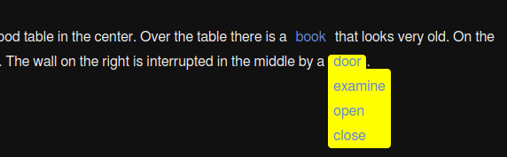

# linkdropdown macro

This macro was written for Twine [SugarCube](http://www.motoslave.net/sugarcube/2/) story format.

The purpose of this macro is to add a dropdown menu to a link. In other words, when you click on a link an overlay opens just below the link: in this area you can add everything you want using SugarCube markup.

I developed it to list all the action available on an object, like this:

Of course you can change colors and spacings with the CSS stylesheet.

You can see here a [working demo](demo.html).

## LICENSE

This program is free software: you can redistribute it and/or modify
it under the terms of the GNU General Public License as published by
the Free Software Foundation, either version 3 of the License, or
(at your option) any later version.

This program is distributed in the hope that it will be useful,
but WITHOUT ANY WARRANTY; without even the implied warranty of
MERCHANTABILITY or FITNESS FOR A PARTICULAR PURPOSE.  See the
GNU General Public License for more details http://www.gnu.org/licenses/.
